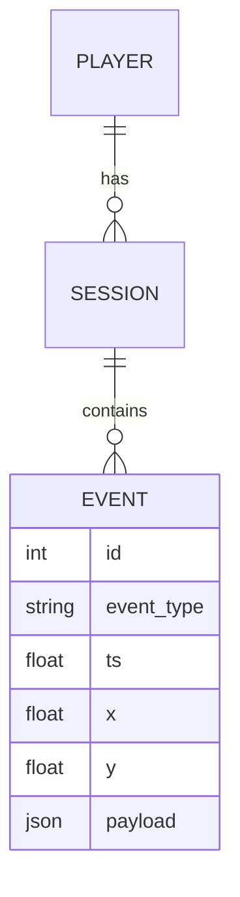

# Схема событий

| Событие | Обязательные поля | Доп. поля | Когда |
|---|---|---|---|
| session_start | session_id, player_id, ts | level | старт сессии |
| death | session_id, ts, level, x, y | cause | смерть игрока |
| checkpoint | … | … | … |
| level_complete | … | time_s | … |
| session_end | … | reason | … |

## ER-диаграмма

